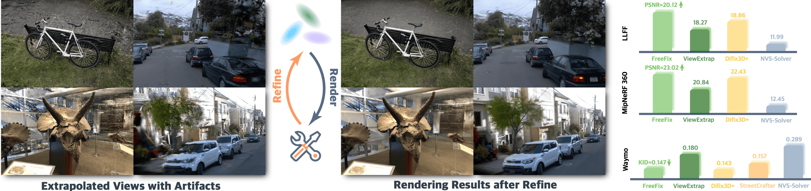

<a id="readme-top"></a>

<!-- PROJECT LOGO -->
<div align="center">
  <h1>FreeFix: Boosting 3D Gaussian Splatting via Fine-Tuning-Free Diffusion Models</h1>
  
  <p>
    <a href="https://xdimlab.github.io/freefix/">
      
    </a>
    <a href="https://arxiv.org/abs/2601.20857">
      
    </a>
  </p>
  
  > Hongyu Zhou<sup>1</sup>, Zisen Saho<sup>2</sup>, Sheng Miao<sup>1</sup>, Pan Wang<sup>3</sup>, Dongfeng Bai<sup>3</sup>, Bingbing Liu<sup>3</sup>, Yiyi Liao<sup>1,†</sup> <br>
  > <sup>1</sup> Zhejiang University <sup>1</sup> University of Maryland, College Park <sup>3</sup> Huawei
  > <sup>†</sup> Corresponding Authors

  

  <br>

  <p align="left">
    This is the official project repository of the paper <b>FreeFix: Boosting 3D Gaussian Splatting via Fine-Tuning-Free Diffusion Models</b>.
  </p>
  
</div>

---

# Installation

First, install [pixi](https://pixi.sh/latest/):

``` bash
curl -fsSL https://pixi.sh/install.sh | sh
```

Then, install the environment by running:
```bash
pixi install
```


# Data Preparation

Download the sample data from [here](https://huggingface.co/datasets/hyzhou404/FreeFix) (The data will be uploaded later) and extract it to the `data/` directory.

# Reconstruction & Refine

## 1. Reconstruction

Train a 3D Gaussian Splatting model on the training views using the command:

```bash
python -m recon.trainer --data_dir <data_directory> --result_dir <result_directory>

# Example
python -m recon.trainer --data_dir data/mipnerf/bicycle --result_dir outputs/mipnerf/bicycle_v2 --data_factor 4
```
<details>
  <summary>optional arguments</summary>
  --data_factor <int>  # downsample factor for the input images
  --prune_scale3d <float>  # scale3d threshold for pruning
  --partition <str>  # partition file for training and validation
  --strategy <str>  # training strategy, choose from ['mcmc', 'ddim']
</details>

The training results, including checkpoints and configuration files, will be saved in `<result_directory>`.

## 2. Refine

Refine the reconstructed model using a diffusion model (e.g., Flux). This step uses the pre-trained 3DGS model from the reconstruction step.

```bash
python -m ours.refine_by_flux --exp_cfg <exp_cfg_path>

# Example
python -m ours.refine_by_flux --exp_cfg exp_cfg/mipnerf/flux_bicycle_v2.yaml
```

**Note:**
- Ensure that the `base_dir` in your experiment configuration file matches the `<result_directory>` from the reconstruction step.
- You can find and customize configuration files in the `exp_cfg/` directory.
- Other refinement methods are also available (e.g., `ours/refine_by_sdxl.py`).

## 3. Evaluation

Evaluate the quantitative results (PSNR, SSIM, LPIPS) of both the reconstructed and refined models.

```bash
python -m ours.evaluation --exp_cfg <exp_cfg_path> --eval_test

# Example
python -m ours.evaluation --exp_cfg exp_cfg/mipnerf/flux_bicycle_v2.yaml --eval_test
```

The evaluation results will be saved in `<result_directory>/<exp_name>/eval/`:
- `29999_test.json`: Metrics for the original reconstruction (step 29999).
- `<exp_name>_test.json`: Metrics for the refined model (e.g., `flux_test.json`).

# Citation

If you find our paper and codes useful, please kindly cite us via:

```bibtex
@inproceedings{zhou2026freefix,
  title={FreeFix: Boosting 3D Gaussian Splatting via Fine-Tuning-Free Diffusion Models},
  author={Zhou, Hongyu and Shao, Zisen and Miao, Sheng and Wang, Pan and Bai, Dongfeng and Liu, Bingbing and Liao, Yiyi},
  booktitle={Thirteenth International Conference on 3D Vision},
  year={2026}
}
```
